# １．vs codeのインストール

以下に従って、vs codeをインストール  

[vs code インストール](https://www.javadrive.jp/vscode/install/index1.html)  

インストール画面に注意 特に以下は重要  
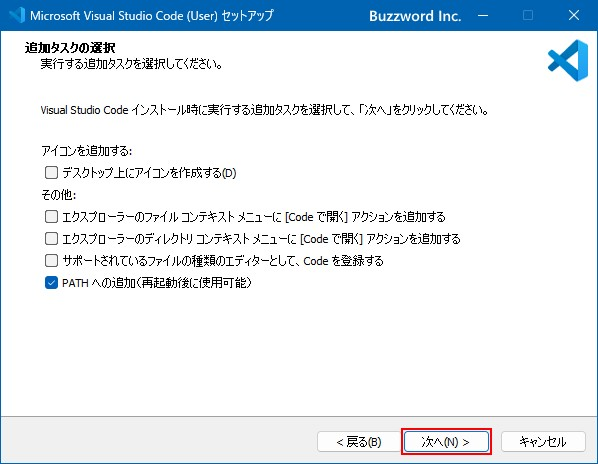

## 日本語化
インストール当初は、英語表示になっている。これを日本語化する
以下に従って日本語化してください。
（インストール済みの言語を切り替えて利用する　の前まで）
[日本語化](https://www.javadrive.jp/vscode/install/index4.html)

python 実行環境はデフォルトインストールされているはずだが
NGなら、上記と同様に拡張機能でpythonをインストール

# ２．vs codeでプログラミング


ログラミングの復習を兼ねて。。

### １．C:\Users\Publicフォルダーの直下に以下２つのフォルダを作成する

　　vs_test1,  vs_test2  
    この操作をvs codeの画面からやってみる

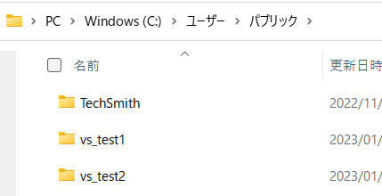


vs code ファイルメニューから　フォルダーを開く　を選択して、ユーザー → パブリック
まで移動したら、以下のようにフォルダーを選択ボタンを押す

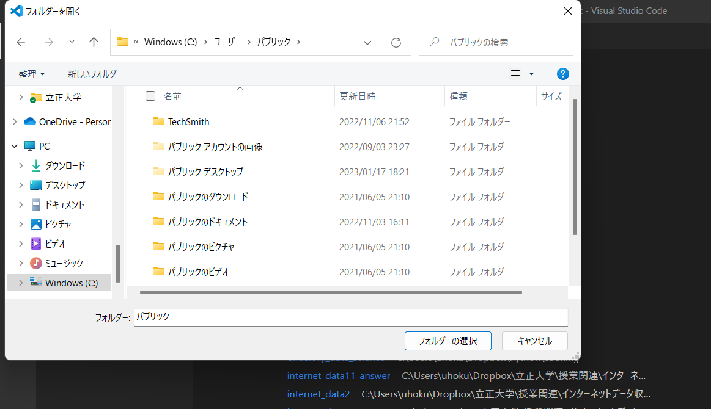

左側のウインドウを右クリックすると以下のようにメニューが表示されるので、
新しいフォルダを選択して、上記のフォルダを作成する

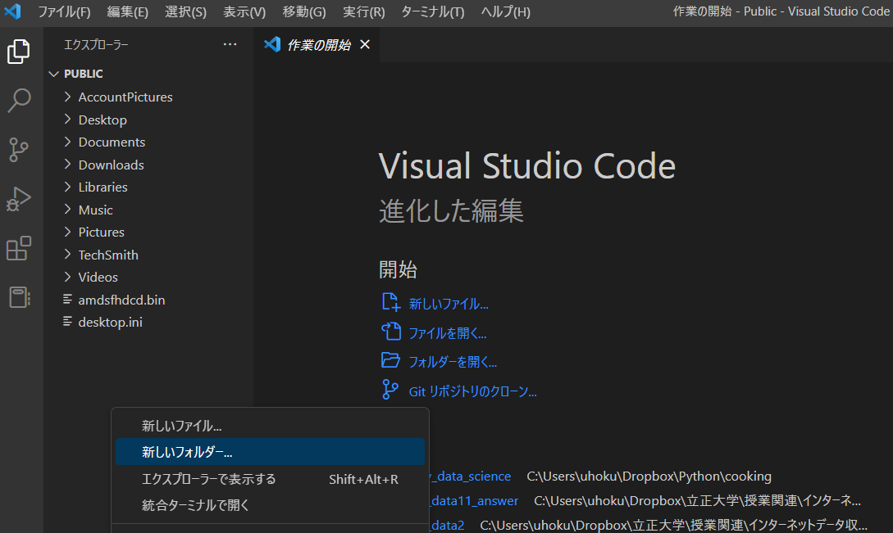

# ３．プログラムを書く

まずは、プログラム detect_words.py を vs_test1に保存してvs_codeから開いてください。
（ファイルメニューから、ファイルを開くを選択　もしくは、左側のウインドウ
　にファイル名が表示されるので、該当ファイルをダブルクリック）


開いたら、まず　コマンドラインのウインドウで
> pip install janome 

次に右上の矢印マークを押すと、プログラムを実行できます
コードを解説します。

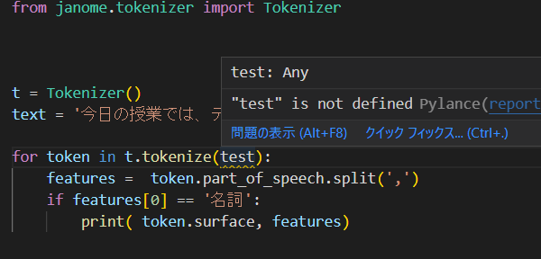

text を、test とタイプインしてください。  

``` python
for token in t.tokenize(text):  
    features =  token.part_of_speech.split(',')  
    if features[0] == '名詞':  
        print( token.surface, features)  
```

以下の通り、波線で警告される。マウスオーバーすると、この変数が定義されていないというメッセージが表示

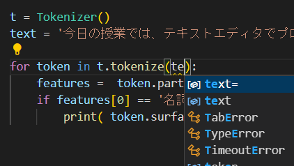

testを消して、te まで入力すると、先読みして候補を提示してくれる  
またtestと再度入力して、クリックすると参照関係にあるtext変数がハイライトされる

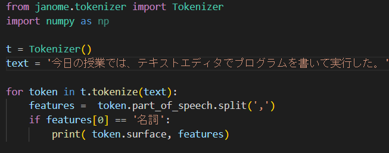

使わないモジュールをimportしてください。
``` python
import  numpy as np
```
使わないモジュールはダークアウトされる

# ３．プログラムを書く２

### １．単語分割プログラムを関数にして、引数に品詞とテキストを渡すと単語列を返すように書き直してください。（結果を画面表示）

こういう感じ　関数の定義def 以下はインデントが必要だが、一括インデントは、cntl + ] 
``` python
def split2words(hinsi, text):
    words=[]
    単語分割のプログラム

    return words # 単語分割した結果をリストに放り込んで返却する

text = '文書'
hinsi ='動詞'
ws = split2words(hinsi, text)
```
### ２．次に、上記の関数部分を別のプログラムファイルにして同じ処理ができるようにしてください。
　　プログラムを新たに書くには以下の通り、ファイルメニューから　新しいテキストファイルを選択し
　　名前を付けて保存　で適当にプログラム名をつけます。なお、拡張子は必ず.pyにすること

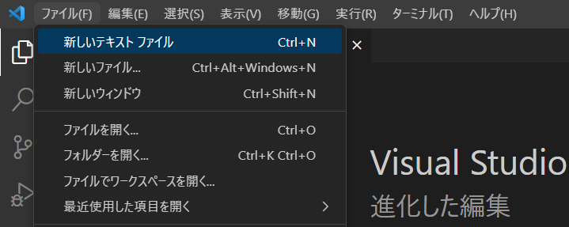

### ３．今度は、vs_test2 のフォルダーを開いて以下のプログラムを作成する
　　まず　名前を付けて保存で、例えば、test2.pyなどの名前をつける（拡張子に注意）以下の行列をnumpyで作成し、全要素を2倍した結果を表示する  
　　
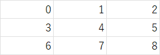  

### ４．終わったら、vs_test1を再度開く。さっきのプログラムはそのまま開いた状態になっている
　　つまり、開発の状態を維持していることがわかる。

# ４．デバッグの方法

プログラム tokenize_tabelog_debug.py と、tabelog.csvを適当なフォルダに保存してvs codeから呼び出して実行してください。

これは、csvから文書をdataframeに読み込んで、単語に分割し、その結果をもとのcsvに
追加するものです。このプログラムには意図的にバグが入っており、そのままでは動作し
ません。これを修正して動作するようにしてください。

もともとのデータ（tabelogの口コミをクローラーで収集してcsvに書き込んだもの）は以下。
プログラムの処理結果、上記データに単語分割した結果が列に加わる（以下）

### １．プログラムを実行する

　　以下のようなエラーになるはず。エラーになった行番号が必ず出力されるので、該当コードの記述に間違いがないかをチェックする

　　tokenize_tabelog_debug.py", line 21, in <module>
      for kuchikomi in tabelog_df('text'):
      TypeError: 'DataFrame' object is not callable

### ２．上記を修正して再度実行

　　これは、関数の中にバグがあるので、メインプログラムで関数を呼び出した行番号、および呼び出された関数中のエラーになった行番号が表示される。修正するべきところは、後者。
```
　　tokenize_tabelog_debug.py", line 23, in <module>
    words = split2words('名詞',kuchikomi)
    File "c:\Users\uhoku\Dropbox\立正大学\授業関連\インターネットデータ収集技術      \program\internet_data1_2\tokenize_tabelog_debug.py", line 13, in split2words      
    if features[0] == hinshi:
NameError: name 'hinshi' is not defined
```
# ５．論理バグを解決する

デバッガと呼ばれるツールで、プログラムの中間的な処理結果を1行づつ追いかけると
おかしなところが見つかる。

[参考サイト](https://qiita.com/jmsrsyunrinsyunki/items/f078b392e31b0c122392)

身長、体重を入力するとBMIを計算してBMI 値と評価コメントを出力するプログラム
[BMI](https://python.atelierkobato.com/bmi/)

``` python
bmi_val, comment = bmi(170, 75)
>bmi: 25.95 アドバイス 前肥満です

bmi_val, comment = bmi(170, 90)
>bmi: 31.14 アドバイス 痩せ気味です　→　なんか変

bmi_val, comment = bmi(170, 110)
>bmi: 38.06 アドバイス 肥満（2度）です

bmi_val, comment = bmi(170, 50)
>bmi: 17.3 アドバイス 肥満（1度）です　→　なんか変
```
コードを見ると、if elseの煩雑な構文でどこがおかしいのか一見ではわかりにくい。そこで、
おかしな結果となっている個所にマークのようなもの（ブレークポイント）をつけて、
この処理結果がプログラム上でどのような経路をたどって得られているのかを追いかける。

以下のように操作してみてください。


### １．ブレークポイントの設定
おかしな処理結果となっている行　bmi_val, comment = bmi(170, 90)　の行番号の左脇
をクリックすると赤い〇をつけることができる。
この状態でデバッグモードで実行すると、プログラムはこの行の1つ手前で停止し、この行に
至る処理の過程を1行筒表示できるモードになる。
この〇で停止させるので、ブレークポイントと呼んでいる

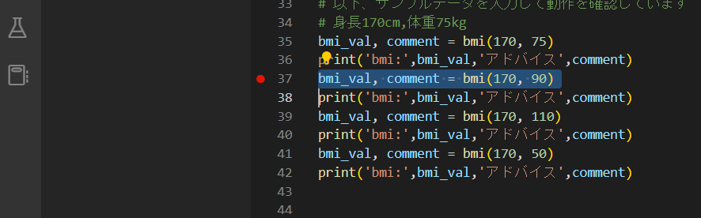


### ２．デバッグモードで実行
右上の実行ボタン（三角マーク）のプルダウンから　pythonファイルのデバッグ　を選択する

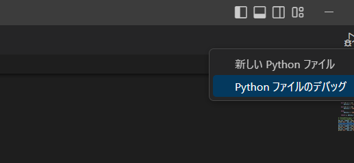

### ３．以下のようにブレークポイントで停止状態になる。また、右上のほうに、1行毎にプログラムを実行するためのボタンメニュー
が表示される


### ４．デバッグメニューをマウスオーバーすると、各ボタンの説明が表示される  
下向き矢印は、関数の中身の処理を逐次表示するモード  

  

### ５．ステップインしてみる
　　下向き矢印を1回押すと、関数の中にはいり、変数h,wに入っている値が表示される。ここまでは正しい模様

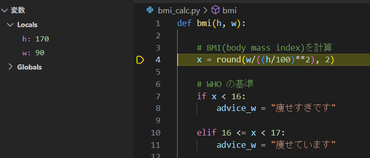

もう一度おすと、xの計算結果が表示される。これも問題なさそう  

  


　その後、何回か押すとif elifの条件文のところに停止して、インデントした中身には停止しない。つまり
　条件にあてはまってないことを意味する。
　以下の条件のみインデントの中身で停止する　ここがおかしなメッセージになっていることがわかる。

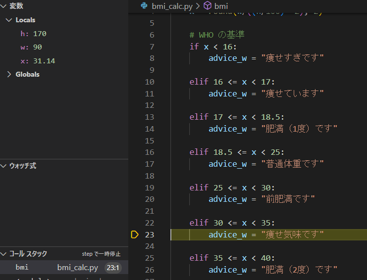


もう一度　押すと以下のようにadvice_wに入っている値を確認できる。つまり、ハイライトされた行の1つ手前の変数の状態
が左上のlocalsに表示される
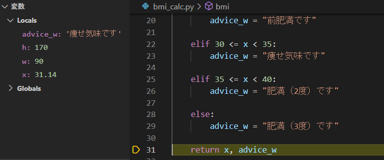


ちなみにステップオーバーは、関数を経由せずに次の処理に移って停止する（試してみてください）

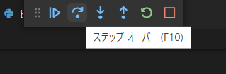

### ６．デバッグモードの終了
ブレークポイントを再度クリックするとポイントが消える
また、以下の■を押すとデバッグメニューが消える  

  
右上の実行ボタンをプルダウンして　新しいpython ファイル　を選択すると、通常の実行モードに戻る。  

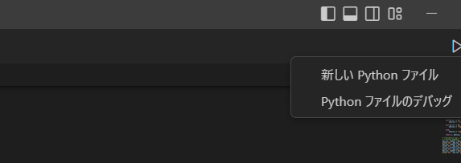